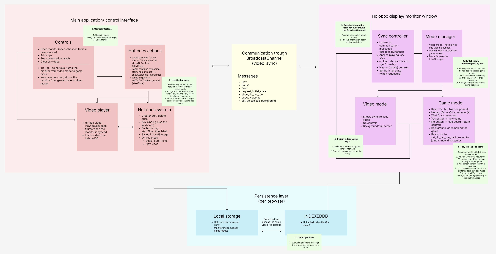

This diagram describes a system where one browser window acts as a control panel and another browser window (the Holobox display) shows either a video or a Tic-Tac-Toe game. The two windows stay synchronized through a BroadcastChannel called `video_sync`.

The left window is the operator's control panel, the middle BroadcastChannel keeps both windows synchronized, and the right Holobox window displays either a synced video or a Tic-Tac-Toe game depending on the commands it receives.

# 1. Main Control Window (left side)

This is where the operator controls everything.

### Controls (remote control for the Holobox)
The operator can:
* Upload videos
* Open the display monitor window
* Create hot cues
* Switch to Tic-Tac-Toe mode
* Switch back to normal video mode

### Video Player
The uploaded video is loaded into an HTML5 video player, which can:
* Play
* Pause
* Seek (jump to a specific time)
* Sync with the display window
* Load videos from IndexedDB storage

### Hot Cue System
A hot cue is basically a saved (in Local Storage) timestamp. Each cue contains:
* a keyboard shortcut
* a label
* a start time

### Hot Cue Actions
Some cues can trigger special actions:
* `show_tic_tac_toe`
* `show_welcome`
* `set_tic_tac_toe_background`

For example:
1. Press a cue key.
2. Video jumps to a specific moment.
3. A message is sent to the Holobox.
4. The Holobox changes mode or background.

# 2. Communication Layer (middle)
The two windows communicate through a BroadcastChannel (`video_sync`), that acts like a messenger between windows. Messages include:
* play
* pause
* seek
* request_initial_state
* show_tic_tac_toe
* show_welcome
* set_tic_tac_toe_background

## Example
Operator presses Play
v
Control window sends `play`
v
Display window receives `play`
v
Video starts playing on the Holobox

# 3. Holobox Display Window (right side)
This is what the audience sees. It contains two major systems:

## Sync Controller
Listens for all incoming messages, and keeps everything synchronized:
* play
* pause
* seek
* mode changes

## Mode Manager
Keeps track of which mode is active and saves the current mode in Local Storage:
* Video Mode
* Game Mode

# 4. Video Mode
Normal/ default playback mode.
* Plays synchronized video
* No controls visible
* Full-screen background

# 5. Game Mode (Tic-Tac-Toe)
When a hot cue sends `show_tic_tac_toe`, the display switches to the game.
* Human = O
* Computer = X
* Winner is announced
* No game controls are visible
* Can use a custom video background

The game also reacts to messages coming from the control window:
* `show_tic_tac_toe`
* `set_tic_tac_toe_background`

# Example Flow: Playing Tic-Tac-Toe

## Step 1
Operator presses a hot cue called:
"Tic Tac Toe"

## Step 2
Control window sends:
`show_tic_tac_toe`

## Step 3
Display window receives the message.

## Step 4
Mode Manager changes from:
Video Mode -> Game Mode

## Step 5
User now sees the Tic-Tac-Toe game.

## Step 6
Player plays against the computer/ VH.

## Step 7
After the game ends, operator can trigger:
`show_welcome` -> display switches back to video mode.

# 6. Persistence Layer (bottom)
This stores data locally inside the browser.
## Local Storage
* Hot cues
* Mode state (video/game)

If the page refreshes, settings are not lost.

## IndexedDB
* Uploaded video files

This allows videos to be reused without uploading again.

# Overall System Flow
Operator
v
Control Interface
v
Video Player / Hot Cues
v
BroadcastChannel (video_sync)
v
Sync Controller
v
Mode Manager
v              v
Video Mode    Game Mode
v              v
Audience sees content
